<h1 align="center">👨🏻‍💻 Luis's Profile 👨🏻‍💻</h1>

<div align="center">
  
  &nbsp;&nbsp;
  
  &nbsp;&nbsp;
  
  &nbsp;&nbsp;
  
</div>

<div align="center">
  
</div><br /><h2 align="center">About Me</h2>

```yaml
  name: Luis Monsalve
  age: 23
  education: Engineer
  music: all
  work: making the world better
  coffe: coding
```

👨‍💻 I describe myself as an Innovative programmer and entrepreneur in the development of applications to make the world a more accessible and dynamic place. Domain of software development and work with different data structures, as well as database management. Ease of teamwork and development.

💻 Web development is something everyone we need today, sooner or later, I can help you to build your professional web page, whit a friendly look and responsive design, also I can help you to make an app (Android/IOS) if you needed.

If you need professional, creative and responsive web design feel free to contact me, I am always with coffee in hand and ready to work! ☕.<br /><div align="center">
  
</div>
<br />
<div align="center">
  
  &nbsp;&nbsp;
  
</div><br /><h2 align="center">🛠️ Technologies and Tools I use 🛠️</h2>

<p align="center">
  
  
  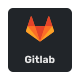
  
  
  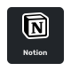
  
  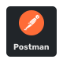
  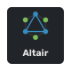
  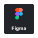
  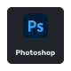
  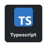
  
  
  
  
  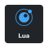
  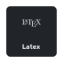
  
  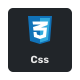
  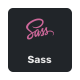
  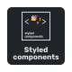
  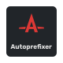
  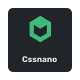
  
  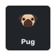
  
  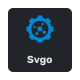
  
  
  
  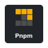
  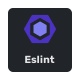
  
  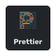
  
  
  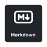
  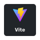
  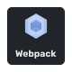
  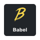
  
  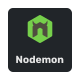
  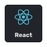
  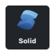
  
  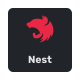
  
  
  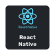
  
  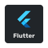
  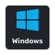
  
  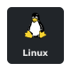
  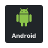
  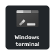
  
  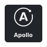
  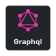
  
  
  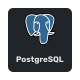
  
  
  
  
  
  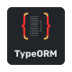
  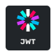
  
  
  
  
  
</p><br /><h2 align="center">📘 My favorites repositories 📘</h2>

<p align="center">
  <a href="https://github.com/LuisCoderDev">
    
  </a>
  <a href="https://github.com/LuisCoderDev">
    
  </a>
</p><br /><div align="center">
  
</div>