

 

<pre align="center">
  <a href="#about">📦 ABOUT ME</a>  •  <a href="#stats">📈 STATS</a>  •  <a href="#repositories">️️️📘 REPOSITORIES</a>
</pre>

<h2 align="center" id="about">
   
  About me
</h2>

 

Professional Software Engineer

I am an innovative programmer and entrepreneur, specializing in creating accessible and dynamic web 
applications. I am a Fullstack Developer with expertise in different data structures, database 
management, and User Interface Design. I have an ease for teamwork and am always ready to work!

  <strong>🚀 Full Tech Stack & Professional Tools</strong>

  <!-- Languages -->
  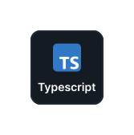
  
  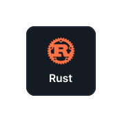
  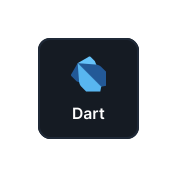
  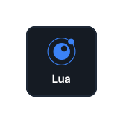
  
  <!-- Frontend & Mobile -->
  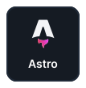
  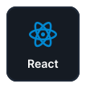
  
  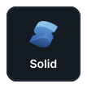
  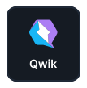
  
  
  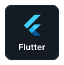

  <!-- Backend & Database -->
  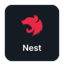
  
  
  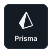
  
  

  <!-- Tools & Workflow -->
  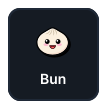
  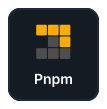
  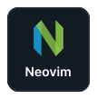
  
  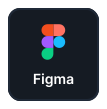
  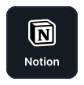
  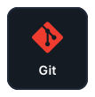
  

  
  &nbsp;&nbsp;&nbsp;&nbsp;&nbsp;&nbsp;
  

 

  

 

<h2 align="center" id="repositories">
  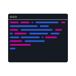
  My favorites repositories
</h2>

<table align="center">
  <tr>
    <td align="center" width="50%">
      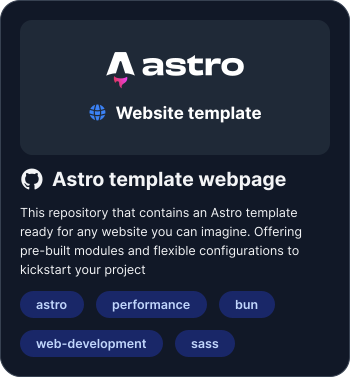
    </td>
    <td align="center" width="50%">
      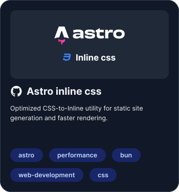
    </td>
  </tr>
  <tr>
    <td align="center" width="50%">
      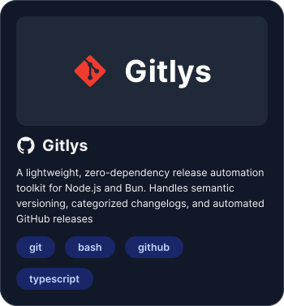
    </td>
    <td align="center" width="50%">
      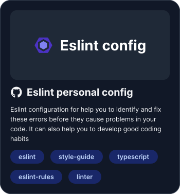
    </td>
  </tr>
</table>

<pre align="center">
  <a href="#top">BACK TO TOP</a>
</pre>

   

  
  &nbsp;&nbsp;
  

