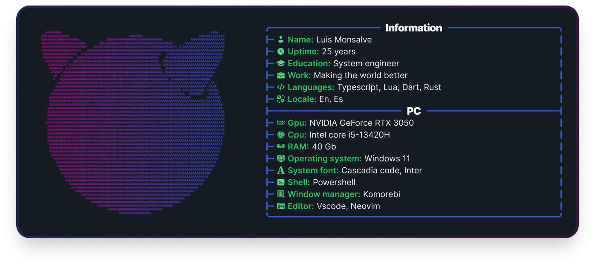
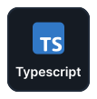

<h1 align="center">🚀 Luis's Profile</h1>

 

<pre align="center">
  <a href="#instalation">📦 SETUP</a> • <a href="#configuration">⚙️ CONFIGURATION</a> • <a href="#features">️️️🛰️ FEATURES</a>
</pre>

<!-- 

  

  

--> <h1 align="center">About me</h1>

👨‍💻 Professional Software Engineer 💻

I am an innovative programmer and entrepreneur, specializing in creating accessible and dynamic web 
applications. I am a Fullstack Developer with expertise in different data structures, database 
management, and User Interface Design 🎨. I have an ease for teamwork and am always ready to work! ☕. 

  
  &nbsp;&nbsp;&nbsp;&nbsp;&nbsp;&nbsp;
  

 

  
  &nbsp;&nbsp;&nbsp;&nbsp;&nbsp;&nbsp;
  

 <h2 align="center">🛠️ Technologies and tools i use</h2>

  
  &nbsp;&nbsp;&nbsp;&nbsp;
  
  &nbsp;&nbsp;&nbsp;&nbsp;
  
  &nbsp;&nbsp;&nbsp;&nbsp;
  
  &nbsp;&nbsp;&nbsp;&nbsp;
  
  &nbsp;&nbsp;&nbsp;&nbsp;
  
  &nbsp;&nbsp;&nbsp;&nbsp;
  
  &nbsp;&nbsp;&nbsp;&nbsp;
  
  &nbsp;&nbsp;&nbsp;&nbsp;
  

 <h2 align="center">📘 My favorites repositories 📘</h2>

  
  

 

  

