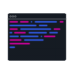

<h2 align="center">
  
  My favorites repositories
</h2>

<table align="center" border="0">
  <tr>
    <td align="center" width="40%">
      
        
      
    </td>
    <td align="center" width="40%">
      
        
      
    </td>
  </tr>
  <tr>
    <td align="center" width="40%">
       
    </td>
    <td align="center" width="40%">
       
    </td>
  </tr>
  <tr>
    <td align="center" width="40%">
      
        
      
    </td>
    <td align="center" width="40%">
      
        
      
    </td>
  </tr>
</table>
